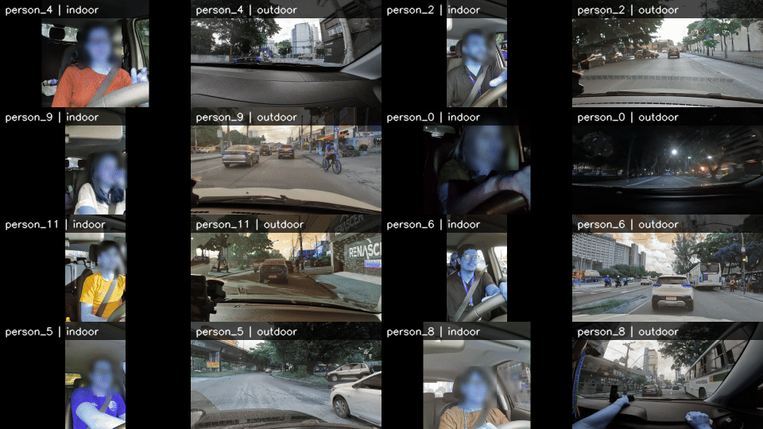

# Anonymous automotive RGB rPPG dataset and benchmark

This repository contains anonymized artifacts for evaluating remote photoplethysmography (rPPG) from RGB video in real-world automotive environments. The collection includes synchronized heart-rate references, evaluation outputs for pretrained rPPG models, anonymized session metadata, and a face-blurred visual teaser.

The full dataset containing the original videos will be made available (a) upon acceptance of the work and (b) upon request for research usage.

## Contents

- `csv/dataset_hr_sync/`: anonymized wearable heart-rate reference tables.
- `csv/session_metadata.csv`: anonymized session metadata.
- `csv/evaluation_outputs/`: event-, subject-, and group-level outputs for the pretrained model configurations.

The export represents 14 driving sessions and 23 completed pretrained model/configuration evaluations. The teaser uses synchronized indoor/outdoor samples from the same sessions and timestamps. Raw videos, consent forms, synchronization documents, and other identifying materials are not included in this repository. The source videos will be made available upon acceptance of the associated work and upon request, subject to applicable consent, ethics, and privacy requirements.

## Data notes

Heart-rate values are intended for research evaluation. Event-level windows overlap in time, so analyses that require uncertainty should treat the recording/participant as the independent unit.

No license is included yet. Add the intended data/software license and any final citation information before public release.
